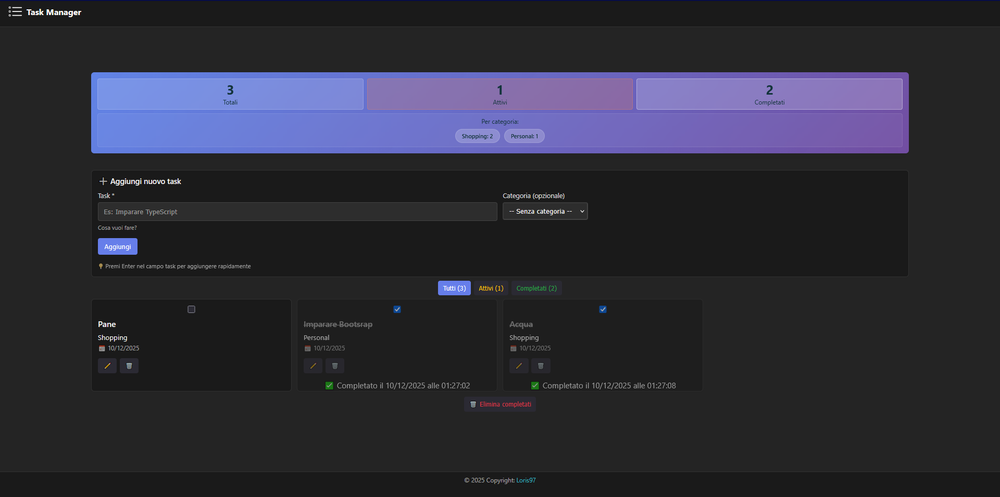

# 📋 Task Manager

> Un'applicazione moderna per la gestione dei task con interfaccia intuitiva e design responsive.

## 🎯 Descrizione

Task Manager è un'applicazione web moderna sviluppata con React e TypeScript che permette di organizzare e gestire i propri task in modo efficiente. L'app offre un'interfaccia pulita e responsive con persistenza dei dati tramite localStorage.

### ✨ Features Principali

- ✅ **Gestione Task Completa** - Crea, modifica, completa ed elimina task
- 🏷️ **Categorie** - Organizza i task per categoria (Work, Shopping, Personal, etc.)
- 🔍 **Filtri Intelligenti** - Visualizza tutti i task, solo attivi o completati
- ✏️ **Edit Inline** - Modifica i task con doppio click direttamente nella card
- 📊 **Dashboard Statistiche** - Monitora il progresso con statistiche in tempo reale
- 💾 **Persistenza Locale** - I dati vengono salvati automaticamente nel browser
- 🎨 **Dark Theme** - Interfaccia moderna con tema scuro
- 📱 **Responsive Design** - Layout ottimizzato per desktop, tablet e mobile
- ⏰ **Timestamp Completi** - Data e ora precise di creazione e completamento

## 🛠️ Tech Stack

### Frontend
- **React 18** - Libreria UI con hooks moderni
- **TypeScript** - Type safety e sviluppo più sicuro
- **Vite** - Build tool veloce per sviluppo e produzione
- **Bootstrap 5** - Grid system responsive e componenti UI

### Architettura
- **Custom Hooks** - `useLocalStorage` per gestione state persistente
- **Component-Based** - Architettura modulare e riutilizzabile
- **Type Safety** - Interfacce TypeScript per ogni entità
- **Functional Components** - Hooks API e performance ottimizzate

## 🚀 Quick Start

### Prerequisiti

- Node.js >= 16.0.0
- npm o yarn

### Installazione

Clona il repository
git clone https://github.com/Loris97/react-todo-list.git

Entra nella directory
cd task-manager

Installa le dipendenze
npm install

Avvia il dev server
npm run dev

L'applicazione sarà disponibile su `http://localhost:5173`

### Build per Produzione

Crea la build ottimizzata
npm run build

Preview della build
npm run preview

## 📖 Utilizzo

### Aggiungere un Task

1. Compila il campo "Task" con la descrizione
2. (Opzionale) Seleziona una categoria dal menu a tendina
3. Premi "Aggiungi" o premi Enter

### Modificare un Task

- **Metodo 1**: Doppio click sul titolo del task
- **Metodo 2**: Click sul pulsante ✏️ Modifica
- Premi Enter per salvare, Esc per annullare

### Completare un Task

- Click sulla checkbox a sinistra del task
- Il task viene marcato come completato con timestamp completo (data e ora)

### Filtrare i Task

Usa i bottoni in alto per filtrare:
- **Tutti** - Mostra tutti i task
- **Attivi** - Solo task non completati
- **Completati** - Solo task completati

## 📂 Struttura Progetto

task-manager/
├── src/
│ ├── components/ # Componenti React
│ │ ├── Navbar.tsx # Barra di navigazione
│ │ ├── Footer.tsx # Footer
│ │ ├── Task.tsx # Card singolo task
│ │ ├── TaskForm.tsx # Form creazione task
│ │ └── TaskStats.tsx # Widget statistiche
│ ├── hooks/ # Custom hooks
│ │ └── useLocalStorage.ts
│ ├── types/ # TypeScript types
│ │ └── task.ts
│ ├── App.tsx # Componente principale
│ ├── App.css # Stili globali
│ ├── main.tsx # Entry point
│ └── index.css # Reset CSS
├── docs/ # Screenshot e documentazione
│ └── screenshot-desktop.jpg
├── public/ # Asset statici
├── package.json
├── tsconfig.json
├── vite.config.ts
└── README.md

## 🎨 Features Tecniche

### Custom Hook: useLocalStorage

Hook personalizzato per gestire lo stato sincronizzato con localStorage:

const [tasks, setTasks] = useLocalStorage<Task[]>('tasks', []);

### Type Safety

Interfacce TypeScript complete per ogni entità:

interface Task {
  id: number;
  nome: string;
  completata: boolean;
  categoria?: string;
  dataCreazione: Date;
  dataModifica: Date;
}

### Responsive Grid

Layout adattivo con Bootstrap grid:
- **Desktop (≥1200px)**: 4 colonne
- **Tablet (≥768px)**: 3 colonne
- **Mobile (≥576px)**: 2 colonne
- **Small Mobile (<576px)**: 1 colonna

## 🔮 Roadmap

### Prossime Features
- [ ] Backend con Node.js + Express
- [ ] Database MongoDB per persistenza cloud
- [ ] Autenticazione utenti (JWT)
- [ ] Sync multi-device
- [ ] Priorità task (Alta, Media, Bassa)
- [ ] Date di scadenza e reminder
- [ ] Tag personalizzati
- [ ] Export/Import JSON
- [ ] Dark/Light theme toggle
- [ ] Ricerca full-text

## 🧪 Testing

Type checking
npx tsc --noEmit

Build test
npm run build

## 📝 Licenza

Questo progetto è rilasciato sotto licenza MIT.

## 👨‍💻 Autore

**Loris97**

- GitHub: [@Loris97](https://github.com/Loris97)

## 🙏 Ringraziamenti

- React Team per l'eccellente documentazione
- Bootstrap per il grid system responsive
- Vite per la developer experience fantastica
- Community open-source per il supporto

---

**⭐ Se questo progetto ti è piaciuto, lascia una stella! ⭐**

Sviluppato con ❤️ usando React e TypeScript

